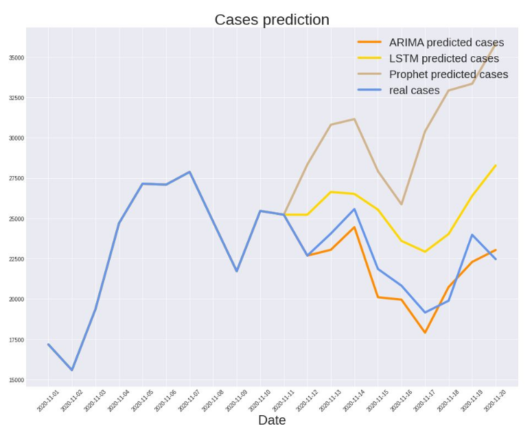

# COVID-19 short-term prediction in Poland

This repo is a slightly enhanced **record of my participation in a student research group project** entitled *"COVID-19 short-term prediction in Poland - a comparative research"*.
 

## What was the project about
My team picked and then **tested and compared different models' performance in regards to short-term pandemic prediction**, including:
* Facebook's Prophet;
* classic regression model: ARIMAX;
* NN model: LSTM.

**With this project, our team took third place in Student Research Groups Competetition (Computer Science Section B)**. 
 

 
Please feel free to check out [those slides](./slides/slides.pdf) in polish.
 

## Data
We utilized [Michał Rogalski's sheet](https://docs.google.com/spreadsheets/d/1ierEhD6gcq51HAm433knjnVwey4ZE5DCnu1bW7PRG3E/edit#gid=1309014089) as our data source.  

## My responsibilties
**My task was to preproccess the data and then train an LSTM model** to see, if it might be doing well despite the relatively small amount of timeseries data.
 
**I'm proud that I've accomplished the task within 2 weeks with little prior knowledge about sequential NN models.**

